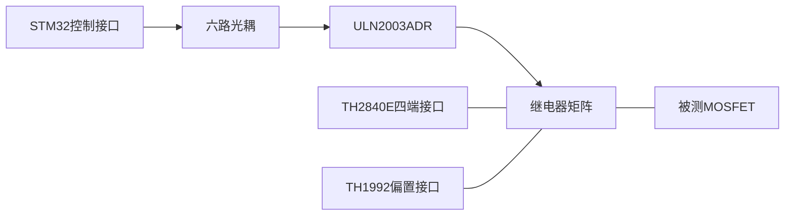
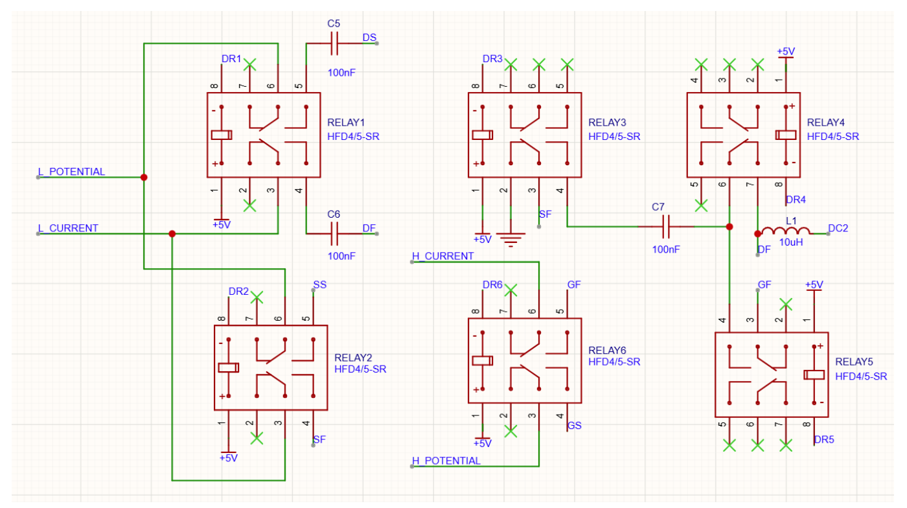

# Matrix Transfer | MOSFET CV 测试继电器矩阵硬件

2026 年第十届全国大学生集成电路创新创业大赛“同惠”企业命题相关硬件设计，用于基于源表及电桥搭建 MOSFET 器件 CV 测试系统。

Matrix Transfer 位于测试仪器与被测器件之间，通过继电器矩阵切换测量通路，面向 Ciss、Coss、Crss 和 Rg 测量。本仓库包含嘉立创 EDA 原理图与 PCB 工程、硬件设计说明、继电器矩阵原理图和 BOM。

## 硬件组成

| 模块 | 主要器件或接口 |
|---|---|
| 继电器矩阵 | 6 个 HFD4/5-SR |
| 控制接口 | STM32 模块排针接口 L、R |
| 光耦与驱动 | 6 路光耦、ULN2003ADR；PCB 器件型号为 CYPC817C |
| 隔离电源 | B0505S-1W 及滤波、去耦器件 |
| 仪器接口 | H_CUR、H_POT、L_CUR、L_POT |
| 接线柱 | CN1–CN4 |

配套仪器为同惠 TH1992 源表和 TH2840E LCR 电桥。

## 硬件模块关系



箭头表示控制链路，连线表示仪器与被测器件的连接关系。

## 继电器矩阵



继电器矩阵切换仪器四端接口与被测器件之间的通路。制板与装配使用 CAD 工程导出的生产资料。

## 文件结构

```text
hardware/
  easyeda-pro/Matrix_Transfer.epru     原理图与 PCB 工程
  easyeda-pro/project2.json           工程配置
  easyeda-pro/library-sources.csv     器件库来源清单
  source/Matrix_Transfer.zip          工程导入与备份文件
  source/SHA256SUMS.txt               工程文件校验值
  bom/bom.csv                        器件清单
docs/
  hardware-overview.md                硬件设计说明
  verification.md                     选型与验证事项
  export-guide.md                     生产资料导出说明
  sources.md                          参考资料
  images/relay-matrix.png              继电器矩阵原理图
THIRD_PARTY_NOTICES.md                 第三方资料说明
```

## 查看设计

使用嘉立创 EDA 专业版导入 [工程备份](hardware/source/Matrix_Transfer.zip)，查看完整原理图、PCB 布局和器件封装。工程保存版本为 3.2.91；直接工程文件和配置位于 `hardware/easyeda-pro/`。导入后先检查图纸、网络与封装，并运行 ERC/DRC，再导出生产资料。

通过 [硬件设计说明](docs/hardware-overview.md) 了解模块和接口，结合 `hardware/bom/bom.csv` 核对器件选型。测试条件与待核实参数见 [验证说明](docs/verification.md)。生产资料导出步骤见 [导出说明](docs/export-guide.md)。

## 参考资料与许可

- [大赛官方“同惠”企业命题页面](https://univ.ciciec.com/nd.jsp?id=1020)
- [同惠电子 2026 赛事介绍](https://www.tonghui.com.cn/newsshow/429.html)
- [第三方资料说明](THIRD_PARTY_NOTICES.md)

仓库暂未指定开源许可证。厂商名称、产品型号与相关资料的权利归各自权利人所有。
